# FASE 2 — ESPECIFICACIÓN TÉCNICA (design.md)

> **Proyecto:** Plataforma ciudadana de cruce de información sobre personas desaparecidas — República Dominicana
> **Versión:** 1.0-draft
> **Propósito:** Arquitectura completa del sistema, modelo de datos, diseño del módulo de ingestión, diseño de API y estrategia de seguridad.

---

## 1. ARQUITECTURA DEL SISTEMA

### 1.1 Diagrama de capas (Clean Architecture)

```mermaid
flowchart TB
    subgraph Presentation["Presentation Layer (Razor Views + Tailwind)"]
        P1["Landing Page"]
        P2["Formulario Reporte"]
        P3["Buscador Público"]
        P4["Panel de Seguimiento"]
        P5["Dashboard Verificador"]
        P6["Dashboard Admin"]
        P7["Panel Salud/Hospital"]
        P8["Mapa de Casos"]
        P9["Exportación PDF/Excel"]
    end

    subgraph Application["Application Layer"]
        A1["Use Cases / CQRS Commands"]
        A2["DTOs / Mappers (AutoMapper)"]
        A3["Validators (FluentValidation)"]
        A4["Interfaces: IReportService IMatchingService INotificationService"]
        A5["Interfaces: IDataSourceConnector IAuditService"]
        A6["Interfaces: IUnitOfWork IRepository<T>"]
    end

    subgraph Infrastructure["Infrastructure Layer"]
        subgraph Persistence["Persistence"]
            I1["DbContext (EF Core)"]
            I2["Repositories (Repository + UoW)"]
            I3["Migrations (Code First)"]
            I4["SQL Server"]
        end

        subgraph Scraping["Ingestion Engine"]
            I5["DataSourceConnectorFactory"]
            I6["PoliciaNacionalScraper"]
            I7["HospitalRegionalScraper"]
            I8["DatosGobDoConnector"]
            I9["ProcuraduriaScraper"]
            I10["HtmlAgilityPack / AngleSharp"]
            I11["HttpClientFactory / Polly (retry + circuit breaker)"]
        end

        subgraph Matching["Matching Engine"]
            I12["FuzzyMatcher (Levenshtein + JaroWinkler)"]
            I13["NormalizadorNombresHispanos"]
            I14["BlockingKeyGenerator"]
            I15["ScoreWeightCalculator"]
        end

        subgraph BackgroundJobs["Background Jobs (Quartz.NET)"]
            I16["ScrapingSchedulerJob"]
            I17["MatchingSchedulerJob"]
            I18["NotificationDispatchJob"]
            I19["DataCleanupJob"]
            I20["SourceHealthCheckJob"]
        end

        subgraph Services["Infrastructure Services"]
            I21["SmsService (Twilio / API local)"]
            I22["EmailService (SendGrid / SMTP)"]
            I23["FileStorageService (local / S3)"]
            I24["GeoService (nominatim reverse geocode)"]
            I25["PdfExportService (DinkToPdf / QuestPDF)"]
            I26["ExcelExportService (ClosedXML)"]
        end
    end

    subgraph Domain["Domain Layer"]
        D1["Entities: PersonaReportada, Reporte, FuenteDatos, ..."]
        D2["ValueObjects: Coordenadas, NombreCompleto, Telefono, ..."]
        D3["Enums: EstadoCaso, TipoAlerta, TipoFuente, ..."]
        D4["Interfaces: IAggregateRoot, IEntity"]
    end

    subgraph External["External Systems"]
        E1["Policía Nacional (boletines web)"]
        E2["Hospitales públicos (listados pacientes NN)"]
        E3["9-1-1 (reportes de emergencia)"]
        E4["datos.gob.do (Portal Datos Abiertos)"]
        E5["Procuraduría (listados)"]
        E6["Alertas RD - Registro Nacional (futuro)"]
        E7["SMS / Email providers"]
    end

    P1 --> A1
    P2 --> A1
    P3 --> A1
    P4 --> A1
    P5 --> A1
    P6 --> A1
    P7 --> A1
    P8 --> A1
    P9 --> A5

    A1 --> A4
    A1 --> A5
    A1 --> A6

    A4 --> I21
    A4 --> I22
    A4 --> I12
    A5 --> I5
    A6 --> I2

    I1 --> I2
    I2 --> I4
    I3 --> I4

    I5 --> I6
    I5 --> I7
    I5 --> I8
    I5 --> I9
    I6 --> I10
    I6 --> I11
    I7 --> I10
    I8 --> I11
    I9 --> I10

    I12 --> I13
    I12 --> I14
    I12 --> I15

    I16 --> I5
    I17 --> I12
    I18 --> A4
    I20 --> I5

    I6 --> E1
    I7 --> E2
    I8 --> E4
    I9 --> E5

    D1 --> A1
    D1 --> I1
```



### 1.2 Stack tecnológico detallado

| Componente | Tecnología | Versión | Justificación |
|---|---|---|---|
| Runtime | .NET | 8.0 LTS | Soporte Microsoft hasta nov. 2026, rendimiento, familiaridad gobierno RD |
| Web framework | ASP.NET Core MVC | 8.0 | Razor Views + Controllers, maduro para gobierno |
| ORM | Entity Framework Core | 8.0 | Code First + Migrations, estándar .NET |
| Base de datos | SQL Server | 2022+ | Contraparte de EF Core, licenciamiento gobierno |
| Frontend | Tailwind CSS | 3.x | Utility-first, responsive nativo, CDN o compilado |
| Background jobs | Quartz.NET | 3.x | Scheduler maduro, cron expressions, persistencia de jobs |
| HTTP client resiliencia | Polly | 8.x | Retry, circuit breaker, timeout policies |
| HTML parsing | AngleSharp | 1.x | DOM moderno, selectores CSS, más robusto que HtmlAgilityPack |
| Fuzzy matching | FuzzySharp (FuzzyWuzzy port) | 2.x | Levenshtein, partial ratio, token sort |
| Validación | FluentValidation | 11.x | Reglas declarativas, integración MVC |
| Mapeo | AutoMapper | 12.x | Domain ↔ DTO mapping |
| PDF | QuestPDF | 2024.x | Sin dependencias COM, API fluida, licencia gratuita para OSS |
| Excel | ClosedXML | 0.102+ | Sin dependencias COM, API simple |
| SMS | Twilio API (o alternativa local) | — | Proveedor con cobertura confirmada en RD |
| Email | MailKit / SendGrid | — | SMTP estándar, delivery tracking |
| Logging estructurado | Serilog | 3.x | Logs a archivo + SQL Server + consola |
| Testing | xUnit + Moq + FluentAssertions | — | Estándar .NET para TDD |
| Mapa (futuro) | Leaflet.js (OSM gratuito) | 1.x | Sin costos de licencia, funcionalidad completa |

---

## 2. MODELO DE DATOS (ER COMPLETO)

### 2.1 Diagrama entidad-relación

```mermaid
erDiagram
    PersonaReportada {
        int Id PK
        string PrimerNombre
        string SegundoNombre
        string PrimerApellido
        string SegundoApellido
        string Alias
        date FechaNacimiento
        date FechaDesaparicion
        int EdadAproximada
        string Sexo
        string TipoDocumento
        string NumeroDocumento
        string Nacionalidad
        string DescripcionFisica
        decimal EstaturaCm
        decimal PesoKg
        string ColorPiel
        string ColorOjos
        string ColorCabello
        string SenasParticulares
        string CondicionMedica
        string MedicamentosRequeridos
        string Vestimenta
        bool EsMenorEdad
        bool EsDiscapacitado
        bool EsAdultoMayor
        bool EsViolenciaGenero
        string TipoAlerta
        string FotoThumbnailUrl
        string FotoWebUrl
        string FotoOriginalUrl
        int EstadoCasoId FK
        int? UltimaUbicacionZonaId FK
        decimal? UltimaUbicacionLat
        decimal? UltimaUbicacionLng
        string UltimaUbicacionTexto
        string CodigoSeguimiento
        datetime FechaCreacion
        datetime FechaUltimaActualizacion
        bool DatosSinteticos
    }

    Reporte {
        int Id PK
        int PersonaId FK
        int ReportanteUsuarioId FK
        string RelacionConDesaparecido
        string TelefonoContacto
        string EmailContacto
        string CodigoVerificacion
        bool Verificado
        datetime FechaReporte
        string Notas
        string FuenteReporte
        string IpOrigen
        bool EsReporteLocalizacion
        string DetalleLocalizacion
    }

    EstadoCaso {
        int Id PK
        string Codigo
        string Nombre
        string Descripcion
        string ColorHex
        int OrdenFlujo
    }

    ZonaGeografica {
        int Id PK
        string Codigo
        string Nombre
        string Tipo
        int? ZonaPadreId FK
        decimal? LatitudCentroide
        decimal? LongitudCentroide
    }

    Usuario {
        int Id PK
        string NombreCompleto
        string Email
        string Telefono
        string PasswordHash
        string Cedula
        int RolId FK
        int? ZonaAsignadaId FK
        bool Activo
        bool Verificado
        string Institucion
        string Cargo
        string TokenVerificacion
        datetime? FechaUltimoAcceso
        datetime FechaRegistro
        bool AceptoTerminos
        bool AceptoConfidencialidad
    }

    Rol {
        int Id PK
        string Nombre
        string Descripcion
        string Permisos
    }

    FuenteDatos {
        int Id PK
        string Codigo
        string Nombre
        string Tipo
        string MetodoAcceso
        string RiesgoLegal
        string UrlBase
        string FormatoDatos
        int IntervaloMinutos
        string SelectorHtml
        string ConfiguracionJson
        bool Activo
        string EstadoSalud
        datetime? UltimaEjecucionOk
        datetime? UltimoError
        int FallosConsecutivos
        int TotalEjecuciones
        int TotalRegistrosObtenidos
        string NotasLegales
    }

    RegistroIngerido {
        long Id PK
        int FuenteId FK
        string IdentificadorExterno
        string PrimerNombre
        string SegundoNombre
        string PrimerApellido
        string SegundoApellido
        string Sexo
        int? EdadAproximada
        string DescripcionFisica
        string UbicacionTexto
        decimal? Latitud
        decimal? Longitud
        string TelefonoContacto
        string InstitucionOrigen
        string UrlOrigen
        string HtmlCrudo
        string EstadoPaciente
        datetime FechaRegistroFuente
        datetime FechaIngesta
        string HashContenido
        bool CoincidenciaProcesada
        int ScoreMaximoCoincidencia
    }

    Coincidencia {
        long Id PK
        int ReportePersonaId FK
        long RegistroIngeridoId FK
        decimal ScoreGeneral
        decimal ScoreNombre
        decimal ScoreEdad
        decimal ScoreSexo
        decimal ScoreUbicacion
        decimal ScoreDescripcion
        string AlgoritmoUsado
        bool Revisada
        int? RevisorUsuarioId FK
        string ResultadoRevision
        string NotasRevision
        datetime FechaDeteccion
        datetime? FechaRevision
    }

    Notificacion {
        long Id PK
        int UsuarioId FK
        int? ReportePersonaId FK
        string Tipo
        string Titulo
        string Mensaje
        bool Leida
        bool Enviada
        string CanalEnvio
        datetime? FechaEnvio
        datetime FechaCreacion
        datetime? FechaLectura
    }

    Auditoria {
        long Id PK
        int? UsuarioId FK
        string Entidad
        int? EntidadId
        string TipoOperacion
        string ValorAnterior
        string ValorNuevo
        string IpOrigen
        string UserAgent
        string Detalles
        datetime Fecha
    }

    Archivo {
        int Id PK
        int? PersonaId FK
        int? ReporteId FK
        string NombreOriginal
        string RutaArchivo
        string TipoContenido
        long TamanoBytes
        string Categoria
        bool Publico
        datetime FechaSubida
        int SubidoPorUsuarioId FK
    }

    CentroSalud {
        int Id PK
        string Codigo
        string Nombre
        string Tipo
        int ZonaId FK
        string Direccion
        string Telefono
        string ContactoEmail
        bool Activo
    }

    Verificacion {
        long Id PK
        int CoincidenciaId FK
        int VerificadorUsuarioId FK
        string TipoVerificacion
        string Resultado
        string MetodoContacto
        string DetalleContacto
        string Notas
        datetime FechaVerificacion
    }

    SesionUsuario {
        long Id PK
        int UsuarioId FK
        string Token
        string RefreshToken
        string IpOrigen
        string UserAgent
        datetime FechaInicio
        datetime? FechaExpiracion
        bool Activa
    }

    PersonaReportada ||--o{ Reporte : "tiene"
    PersonaReportada ||--o{ Coincidencia : "genera"
    PersonaReportada ||--o{ Archivo : "asociado"
    PersonaReportada ||--|{ EstadoCaso : "clasificado como"
    PersonaReportada ||--o{ ZonaGeografica : "ultima ubicacion en"

    Reporte ||--|| PersonaReportada : "refiere a"
    Reporte ||--|| Usuario : "creado por"

    Usuario }|--|| Rol : "tiene"
    Usuario ||--o{ ZonaGeografica : "asignado a"
    Usuario ||--o{ Verificacion : "realiza"
    Usuario ||--o{ Reporte : "crea (alternativo)"

    RegistroIngerido }|--|| FuenteDatos : "proviene de"
    RegistroIngerido ||--o{ Coincidencia : "genera"

    Coincidencia ||--|| PersonaReportada : "match con"
    Coincidencia ||--|| RegistroIngerido : "match con"
    Coincidencia ||--o{ Verificacion : "verificado por"

    Notificacion }|--|| Usuario : "dirigida a"
    Notificacion ||--o{ PersonaReportada : "referente a"

    Auditoria ||--o{ Usuario : "realizada por"

    ZonaGeografica ||--o{ ZonaGeografica : "jerarquia padre-hijo"

    CentroSalud }|--|| ZonaGeografica : "ubicado en"

    SesionUsuario }|--|| Usuario : "pertenece a"
```

### 2.2 Diccionario de entidades clave

| Entidad | Descripción | Volumen estimado (MVP) | Volumen (plena) |
|---|---|---|---|
| `PersonaReportada` | Persona desaparecida (datos + foto + estado) | 500-1,000 | 50,000+ |
| `Reporte` | Reporte ciudadano (uno por persona, puede haber múltiples reportes para la misma persona) | 1,000 | 100,000+ |
| `EstadoCaso` | Catálogo de estados (Recibido, EnVerificación, CoincidenciaDetectada, EnInvestigacion, LocalizadoVivo, LocalizadoFallecido, CerradoSinResolver) | ~8 | ~15 |
| `ZonaGeografica` | Jerarquía: país → provincia → municipio | ~190 (32 provincias + 158 municipios) | ~190 |
| `Usuario` | Todos los usuarios registrados | 50 | 10,000+ |
| `Rol` | Catálogo de roles funcionales | ~6 | ~8 |
| `FuenteDatos` | Configuración de cada fuente externa scrapeada | 2-3 | 15+ |
| `RegistroIngerido` | Cada registro obtenido de scraping externo | 10,000 | 5,000,000+ |
| `Coincidencia` | Pair de match entre reporte y registro ingerido | 5,000 | 500,000+ |
| `Notificacion` | Notificaciones generadas | 2,000 | 200,000+ |
| `Auditoria` | Log de cambios (solo writes) | 10,000 | 1,000,000+ |
| `Archivo` | Fotos y documentos asociados | 500 | 50,000+ |
| `CentroSalud` | Hospitales/clínicas registrados | 5 | 500+ |
| `Verificacion` | Acción de verificación de coincidencia | 500 | 50,000+ |

### 2.3 Estrategia de índices

| Tabla | Índice | Tipo | Justificación |
|---|---|---|---|
| `PersonaReportada` | IX_Persona_Nombres | Compuesto (PrimerNombre, SegundoNombre, PrimerApellido, SegundoApellido) | Búsqueda por nombre es el caso de uso más frecuente |
| `PersonaReportada` | IX_Persona_EstadoCaso | Simple (EstadoCasoId) | Filtrado por estado |
| `PersonaReportada` | IX_Persona_FechaDesaparicion | Simple (FechaDesaparicion) | Ordenamiento temporal |
| `PersonaReportada` | IX_Persona_CodigoSeguimiento | Único (CodigoSeguimiento) | Búsqueda por código de seguimiento |
| `PersonaReportada` | IX_Persona_Sinteticos | Filtrado (include DatosSinteticos=0) | Excluir datos sintéticos en consultas reales |
| `RegistroIngerido` | IX_Registro_Nombres | Compuesto (PrimerNombre, PrimerApellido) | Bloqueo por apellido en matching |
| `RegistroIngerido` | IX_Registro_FuenteFecha | Compuesto (FuenteId, FechaRegistroFuente) | Consultas por fuente |
| `RegistroIngerido` | IX_Registro_Hash | Único (HashContenido) | Deduplicación |
| `RegistroIngerido` | IX_Registro_CoincidenciaProcesada | Filtrado (CoincidenciaProcesada=false) | Matching batch |
| `Coincidencia` | IX_Coincidencia_Persona | Simple (ReportePersonaId) | Coincidencias por persona |
| `Coincidencia` | IX_Coincidencia_Revisada | Filtrado (Revisada=false, ScoreGeneral desc) | Cola de verificación priorizada |
| `Auditoria` | IX_Auditoria_Fecha | Simple (Fecha) | Reportes de auditoría por rango |
| `Notificacion` | IX_Notificacion_Usuario | Compuesto (UsuarioId, Leida, FechaCreacion desc) | Bandeja de notificaciones |
| `ZonaGeografica` | IX_Zona_Tipo | Simple (Tipo) | Filtro provincias/municipios |

---

## 3. MÓDULO DE INGESTIÓN DE DATOS EXTERNOS

### 3.1 Evaluación legal de fuentes (tabla completa)

| Fuente | Tipo | ¿Directamente scrapeable? | Método de acceso | Riesgo legal | Alternativa con convenio | Prioridad |
|---|---|---|---|---|---|---|
| **Policía Nacional** — boletines de personas desaparecidas publicados en sitio web | Web pública | Sí (actualmente publican PDFs/listados con datos que ellos mismos ponen a disposición pública). Fundamento: datos ya publicados activamente por la institución (Ley 172-13 Art. 2: datos públicos son accesibles). | Scraper de HTML/PDF en URL conocida de la PN. | **Medio**: aunque son datos públicos, la Ley 172-13 exige finalidad lícita. El scraping debe limitarse a lo ya publicado, no a sistemas internos. No violar ToS. | Convenio con Policía Nacional para feed API directo del Registro Nacional (Ley 25-26). | **P0** (primera fuente MVP) |
| **Hospitales públicos** — listados de pacientes NN ingresados | Web / sistemas internos | **No scrapeable directamente** (los hospitales no publican sistemáticamente listados de pacientes NN en sitios web públicos accesibles). | Requiere convenio con SNS (Servicio Nacional de Salud) para API o reporte periódico. En MVP: simular con datos sintéticos. | **Alto**: intentar scrapear sistemas hospitalarios internos sería ilegal. Los datos de pacientes NN son sensibles (salud). | Convenio SNS + each hospital regional → reporte diario estructurado. | **P1** (MVP simulado, real en fase 2) |
| **Procuraduría General** — listados de personas fallecidas no identificadas | Web / sistemas internos | **Parcialmente scrapeable**: la PGR publica ocasionalmente listados de cuerpos NN en medios. No hay feed estructurado ni publicación sistemática. | Scraper condicional (solo cuando hay publicación pública). | **Medio**: datos ya publicados son información pública, pero la falta de sistematicidad hace que el scraper tenga baja cobertura. | Convenio con PGR para acceso al sistema de forenses (INACIF). | **P2** |
| **datos.gob.do** — Portal Nacional de Datos Abiertos | API + descarga | **Sí, scrapeable/comsumible directamente** (específicamente diseñado para ser consumido). Datos.gob.do está gobernado por la Política Nacional de Datos Abiertos que fomenta la reutilización. | API REST (CKAN) con datasets en JSON/CSV. | **Bajo**: la política de datos abiertos (PNDA-RD) explícitamente promueve la reutilización de estos datos. Sin riesgo legal si se respeta la licencia. | N/A — es el método recomendado. | **P1** |
| **9-1-1** — reportes de emergencia | Sistema cerrado | **No scrapeable** (sistema cerrado de emergencias, datos no publicados). | Requiere convenio interinstitucional. | **Alto**: intentar acceder a datos del 911 sin autorización es ilegal. Datos sensibles de emergencias. | Convenio con Sistema 9-1-1 para reportes anonimizados de personas extraviadas. | **P2** (futuro) |
| **Medios de comunicación digitales** (Listín, Diario Libre, etc.) | Web pública | **Sí, scrapeable condicionalmente**: noticias sobre personas desaparecidas son contenido público. Sin embargo, la extracción masiva puede violar ToS. | Scraper de búsquedas por palabras clave "desaparecido", "búsqueda", etc. | **Medio-Alto**: depende del ToS del medio. Algunos lo prohíben explícitamente. La extracción manual de una noticia específica no es problema, pero el scraping masivo sí. | Convenio con ASDE (Asoc. de Medios) o suscripción a APIs de noticias. | **P2** (futuro) |
| **Redes sociales** (Facebook grupos, Twitter/X) | APIs / web | **No recomendable**: las APIs de redes sociales tienen restricciones severas para búsqueda de personas. El scraping web de redes viola ToS. | No implementar en MVP. | **Alto**: violación de ToS, riesgo de cierre de cuenta IP. Además, la calidad de los datos no es verificable. | Alianza con organizaciones como Asodofade que operan grupos de búsqueda en redes. | **P2** (fuera del alcance actual) |
| **Alertas RD** — Registro Nacional (futuro) | API oficial (futura) | **No disponible aún** (Ley promulgada junio 2026, el sistema está en creación). | En el futuro: API REST oficial del Registro Nacional (Ley 25-26). | **Bajo** (con convenio): el registro fue creado por ley para ser consultado interinstitucionalmente. | Será la fuente principal una vez operativa. El MVP debe diseñarse para integrarse fácilmente. | **P0** (diseño preparado, integración real en futura fase) |

### 3.2 Pipeline de ingestión (diseño detallado)

```
┌─────────────────────────────────────────────────────────────────────────┐
│                     PIPELINE DE INGESTIÓN                                │
│  Módulo aislado, reemplazable → IDataSourceConnector                     │
└─────────────────────────────────────────────────────────────────────────┘

    INICIO (trigger: cron schedule + manual)
         │
         ▼
    ┌─────────────┐
    │ 1. FETCH    │  HttpClient con Polly: retry(3) + circuit breaker + timeout(30s)
    │             │  Headers: User-Agent rotatorio, Accept: text/html, Accept-Language: es-DO
    └──────┬──────┘
           │
           ▼
    ┌─────────────┐
    │ 2. PARSE    │  AngleSharp → DOM → selectores CSS definidos en FuenteDatos.SelectorHtml
    │             │  Si cambia estructura → log warning + estado "Caído" tras 3 fallos
    └──────┬──────┘
           │
           ▼
    ┌─────────────┐
    │ 3. EXTRACT  │  Mapeo de nodos HTML → List<RawRecord> (diccionario clave-valor)
    │             │  Normalización: trim, lower, encoding (especialmente acentos, ñ)
    └──────┬──────┘
           │
           ▼
    ┌─────────────┐
    │ 4. VALIDATE │  Reglas por fuente: campos obligatorios, formato fechas, rangos edad
    │             │  Registros inválidos → log + skip (no detienen el lote)
    └──────┬──────┘
           │
           ▼
    ┌─────────────┐
    │ 5. DEDUP    │  Hash SHA256 del contenido → si existe hash, skip (update si cambió)
    │             │  Evita duplicados intra-fuente e inter-fuente
    └──────┬──────┘
           │
           ▼
    ┌─────────────┐
    │ 6. STORE    │  Guardar en RegistroIngerido con:
    │             │  - FuenteId, fecha ingesta = NOW, HashContenido
    │             │  - HtmlCrudo (para depuración forense)
    └──────┬──────┘
           │
           ▼
    ┌─────────────┐
    │ 7. LOG      │  Serilog: fuente, registros obtenidos, duración, errores
    │             │  Actualizar FuenteDatos: UltimaEjecucionOk, TotalRegistrosObtenidos
    └──────┬──────┘
           │
           ▼
    ┌─────────────┐
    │ 8. NOTIFY   │  Si la fuente cayó o se recuperó → notificar al admin
    │             │  Si hay registros nuevos → trigger flag para matching
    └─────────────┘
```

### 3.3 Interfaz IDataSourceConnector

```csharp
// Domain/Interfaces/IDataSourceConnector.cs
public interface IDataSourceConnector
{
    string SourceCode { get; }
    string SourceName { get; }
    Task<IngestionResult> FetchAsync(CancellationToken ct);
    bool CanHandle(DataSourceType type);
}

public class IngestionResult
{
    public bool Success { get; set; }
    public int RecordsExtracted { get; set; }
    public int RecordsInserted { get; set; }
    public int RecordsDuplicated { get; set; }
    public int RecordsInvalid { get; set; }
    public TimeSpan Duration { get; set; }
    public List<IngestionError> Errors { get; set; } = new();
    public string RawResponsePreview { get; set; }
}

public class IngestionError
{
    public ErrorType Type { get; set; } // HttpError, ParseError, ValidationError, StructureChanged
    public string Message { get; set; }
    public string Detail { get; set; }
    public bool IsFatal { get; set; }
}
```

### 3.4 Implementaciones por fuente (MVP)

| Conector | Fuente | URL base | Selector HTML | Frecuencia |
|---|---|---|---|---|
| `PoliciaNacionalConnector` | PN boletines desaparecidos | (por determinar: ej. https://policianacional.gob.do/desaparecidos) | `.desaparecidos-lista .item` | Cada 30 min |
| `DatosGobDoConnector` | datos.gob.do | `https://datos.gob.do/api/3/action/` | N/A (API JSON) | Cada 60 min |
| `HospitalSimuladoConnector` | Hospital sintético (demo) | N/A (genera datos) | N/A | A demanda |

### 3.5 Manejo de fallos y resiliencia

| Condición | Comportamiento |
|---|---|
| **HTTP 503 / timeout** | Reintentar con retroceso exponencial: 1s → 5s → 30s → marcar como caído. Máximo 3 reintentos por ejecución. |
| **HTML estructura cambiada** | Si el scraper encuentra 0 registros en 2 ejecuciones consecutivas (donde antes encontraba >0), se asume cambio estructural. Marcar fuente como "⚠️ Posible cambio estructural" y loguear preview del HTML. |
| **Fuente caída >24h** | Notificar al admin por correo+panel. No detener otras fuentes. |
| **Error parcial (10% fallaron)** | Insertar los válidos, loguear los inválidos. No abortar el lote completo. |
| **Fuente envía datos maliciosos** | Validación de tamaño máximo por registro (10KB). Desinfección de HTML. No ejecutar scripts. |
| **Rate limiting detectado (HTTP 429)** | Detener scraping de esa fuente por `Retry-After` header + 1 min adicional. Loguear advertencia. |
| **Simulación (modo demo)** | Los conectores en modo demo devuelven datos sintéticos con flag `DatosSinteticos=true`. Jamás mezclar datos reales con sintéticos sin marcarlos. |

---

## 4. ALGORITMO DE MATCHING (MOTOR DE COINCIDENCIAS)

### 4.1 Diseño general

```
Entrada:
  - Registros ingeridos nuevos (CoincidenciaProcesada = false)
  - Reportes activos (EstadoCaso = EnVerificación | CoincidenciaDetectada)

Proceso:
  1. Bloqueo (partitioning) por PRIMERA LETRA DEL APELLIDO (reduce comparaciones)
  2. Para cada par (reporte, registro) en el mismo bloque:
     a. Normalizar nombres (quitar acentos, expandir abreviaturas comunes "José"→"Jose", "Mª"→"Maria")
     b. Calcular scores individuales
     c. Calcular score ponderado
     d. Si score >= umbral mínimo → crear Coincidencia (o actualizar si ya existe)
  3. Notificar a verificadores si score >= umbral de notificación

Salida:
  - Coincidencias nuevas creadas/actualizadas
  - Notificaciones disparadas
  - Registros marcados como procesados
```

### 4.2 Algoritmos de similitud

| Campo | Algoritmo | Peso (%) | Notas |
|---|---|---|---|
| Nombre completo | Jaro-Winkler (optimizado para nombres hispanos) | 40% | Penaliza menos diferencias en apellidos compuestos |
| Edad | Diferencia absoluta normalizada (max 20 años) | 15% | Score = 1 - (diff/20). Si diff >20 → 0 |
| Sexo | Coincidencia exacta o no aplica | 10% | Binario: 0 o score completo |
| Ubicación (texto) | Token Sort Ratio (FuzzySharp) | 15% | Compara tokens individuales "Santo Domingo" ≈ "Santo Domingo Este" |
| Ubicación (coordenadas) | Distancia Haversine (si hay lat/lng) | 10% | Si distancia <5km → score completo. Decae lineal. |
| Descripción física | Partial Ratio (FuzzySharp) en texto tokenizado | 10% | Sobre palabras clave (tatuajes, color cabello, etc.) |

**Fórmula del score general:**
```
ScoreGeneral = Σ(wi × si)  donde wi = peso, si = score normalizado [0,1]
```

### 4.3 Umbrales configurables

| Parámetro | Valor por defecto | Descripción |
|---|---|---|
| `MinScoreToCreateMatch` | 0.50 (50%) | Score mínimo para crear una coincidencia en BD |
| `MinScoreToNotify` | 0.75 (75%) | Score mínimo para notificar automáticamente a verificadores |
| `MinScoreToNotifyFamily` | 0.85 (85%) | Score mínimo para notificar al familiar (precaución: evitar falsas esperanzas) |
| `BlockingKeyLength` | 1 | Primeras N letras del apellido para bloqueo |
| `MaxAgeDiffYears` | 20 | Diferencia máxima de edad considerada |

### 4.4 Integración con el sistema

```
┌──────────────┐     ┌─────────────────┐     ┌──────────────┐
│  Ingestion   │────>│  Matching Engine │────>│ Notification │
│  Pipeline    │     │  (Quartz job)    │     │  Dispatcher  │
└──────────────┘     └─────────────────┘     └──────────────┘
       │                      │                       │
       ▼                      ▼                       ▼
┌──────────────┐     ┌─────────────────┐     ┌──────────────┐
│Registro      │     │  Coincidencia   │     │  Notificacion│
│Ingerido      │     │  (BD)           │     │  (BD)        │
└──────────────┘     └─────────────────┘     └──────────────┘
```

---

## 5. DISEÑO DE API REST INTERNA

### 5.1 Principios de diseño

- **Formato**: JSON (application/json)
- **Versionado**: Header `Accept: application/vnd.lostpeople.v1+json`
- **Autenticación**: JWT Bearer Token
- **Documentación**: Swagger / OpenAPI 3.0 (incluida en el build)
- **Rate limiting**: 100 req/min por token autenticado, 10 req/min por IP anónima
- **Paginación**: `?page=1&pageSize=20`, respuesta con `total`, `page`, `pageSize`, `totalPages`
- **Respuesta estándar**: `{ "success": true, "data": {}, "error": null }`

### 5.2 Endpoints del API

#### Públicos (sin autenticación)

| Método | Path | Descripción | Prioridad |
|---|---|---|---|
| GET | `/api/v1/public/stats` | Estadísticas públicas (casos activos, resueltos) | P1 |
| GET | `/api/v1/public/persons` | Buscar personas (filtros: nombre, edad, provincia, estado) | P0 |
| GET | `/api/v1/public/persons/{id}` | Detalle público de persona (datos limitados) | P0 |
| POST | `/api/v1/public/reports` | Crear reporte ciudadano (sin auth) | P0 |
| POST | `/api/v1/public/reports/verify-contact` | Verificar contacto (enviar código SMS/correo) | P0 |
| GET | `/api/v1/public/reports/{code}/status` | Estado de reporte por código de seguimiento | P0 |

#### Autenticados (rol variado)

| Método | Path | Descripción | Roles |
|---|---|---|---|
| PUT | `/api/v1/reports/{id}/close` | Cerrar reporte (localizado) | Familiar, AgentePolicial |
| POST | `/api/v1/persons/{id}/photos` | Subir foto de persona | Familiar, Verificador, Admin |
| GET | `/api/v1/matches/pending` | Lista coincidencias pendientes | Verificador, Admin |
| PUT | `/api/v1/matches/{id}/review` | Revisar coincidencia (confirmar/descartar) | Verificador, AgentePolicial |
| POST | `/api/v1/health/patients` | Registrar paciente NN en hospital | PersonalSalud |
| GET | `/api/v1/health/patients/{id}/matches` | Consultar matches de paciente NN | PersonalSalud |
| GET | `/api/v1/notifications` | Lista notificaciones del usuario | Todos los autenticados |
| PUT | `/api/v1/notifications/{id}/read` | Marcar notificación como leída | Todos los autenticados |

#### Administrativos (rol Admin / SuperAdmin)

| Método | Path | Descripción | Roles |
|---|---|---|---|
| GET | `/api/v1/admin/dashboard` | Métricas del dashboard | Admin, SuperAdmin |
| GET | `/api/v1/admin/sources` | Lista fuentes de datos con estado | Admin |
| POST | `/api/v1/admin/sources/{id}/trigger` | Ejecutar scraping manual | Admin |
| PUT | `/api/v1/admin/sources/{id}/toggle` | Activar/desactivar fuente | Admin |
| GET | `/api/v1/admin/users` | Gestionar usuarios | Admin |
| PUT | `/api/v1/admin/users/{id}/verify` | Verificar usuario | Admin |
| GET | `/api/v1/admin/audit` | Log de auditoría | SuperAdmin |
| PUT | `/api/v1/admin/config/matching` | Configurar umbrales matching | SuperAdmin |
| GET | `/api/v1/admin/exports/report` | Exportar reporte consolidado | SuperAdmin |

### 5.3 Ejemplo de payloads

**POST /api/v1/public/reports**
```json
{
  "primerNombre": "Juan",
  "segundoNombre": "Carlos",
  "primerApellido": "Pérez",
  "segundoApellido": "Martínez",
  "fechaNacimiento": "1990-05-15",
  "edadAproximada": 36,
  "sexo": "Masculino",
  "tipoDocumento": "Cédula",
  "numeroDocumento": "001-1234567-8",
  "descripcionFisica": "Tatuaje de cruz en brazo derecho, cicatriz en ceja izquierda",
  "estaturaCm": 172,
  "pesoKg": 75,
  "colorPiel": "Moreno",
  "colorOjos": "Marrón",
  "colorCabello": "Negro",
  "senasParticulares": "Lunar en mejilla derecha",
  "condicionMedica": "Diabetes tipo 2",
  "medicamentosRequeridos": "Metformina",
  "vestimenta": "Camisa azul, jeans, tenis blancos",
  "ultimaUbicacionTexto": "Av. 27 de Febrero, Santo Domingo, frente a Acrópolis",
  "ultimaUbicacionLat": 18.4735,
  "ultimaUbicacionLng": -69.9353,
  "relacionReportante": "Hermano",
  "telefonoContacto": "809-555-0101",
  "emailContacto": "juan@email.com"
}
```

**Respuesta:**
```json
{
  "success": true,
  "data": {
    "reporteId": 1024,
    "codigoSeguimiento": "LP-7F3K2",
    "mensaje": "Reporte recibido correctamente. Guarda tu código LP-7F3K2 para dar seguimiento.",
    "estado": "Recibido"
  }
}
```

---

## 6. ESTRATEGIA DE SEGURIDAD

### 6.1 Validación de reportes (prevención de falsos/maliciosos)

| Control | Descripción | Implementación |
|---|---|---|
| **Rate limiting por IP** | Máximo 3 reportes/hora desde misma IP | Middleware ASP.NET + memoria caché distribuida |
| **Rate limiting por teléfono** | Máximo 1 reporte/hora por número | Validación en Application layer |
| **Verificación de contacto** | Enviar código SMS/correo al reportante antes de activar el reporte | El reporte queda "pendiente" hasta que el código es ingresado en <15 min |
| **ReCAPTCHA v3** | Score de sospecha en formulario de reporte | Incluir v3 (invisible, no friction) en formularios públicos |
| **Detección de duplicados** | Si el mismo nombre+teléfono aparece en múltiples reportes en <1h | Flag de "posible duplicado" para revisión manual |
| **Límite de reportes por persona** | Máximo 5 reportes activos simultáneos por contacto | Aplicación layer |
| **Marca de agua en fotos** | Overlay semitransparente con ID de reporte y fecha | Prevención de reutilización maliciosa de imágenes |
| **Análisis de texto** | Detección de lenguaje ofensivo o incoherente | Lista de términos bloqueados + validación simple de NLP |
| **Verificación escalonada** | Voluntarios verifican coincidencias antes de notificar a familiares | Verificación humana para matches >70% |

### 6.2 Protección de datos sensibles

| Dato | Clasificación | Almacenamiento | Acceso | Exposición pública |
|---|---|---|---|---|
| Nombre completo de desaparecido | Público (con autorización) | Texto plano en BD (cifrado en reposo) | Todos los roles | Sí, visible en búsqueda |
| Nombre de menor | Alto | Texto plano + flag EsMenorEdad | Verificador+, Admin | Solo inicial del nombre |
| Foto de desaparecido | Público (opt-in) | Archivo cifrado (AES-256) | Todos los roles | Sí, con watermark |
| Foto de menor | Alto | Archivo cifrado + acceso restringido | Verificador+, Admin | No |
| Condición médica | Muy alto (dato sensible Ley 172-13 Art. 4) | Cifrado AES-256 columna | AgentePolicial, PersonalSalud | No |
| Teléfono de contacto | Alto | Cifrado AES-256 columna | Verificador+, Admin | No |
| Cédula | Alto | Hash SHA256 + cifrado AES-256 | Admin, SuperAdmin | No |
| Ubicación exacta | Medio | Texto plano (es necesaria para búsqueda) | Todos | Solo provincia, no dirección exacta |
| IP origen | Alto | Almacenar solo en Auditoría, cifrado | SuperAdmin | No |

### 6.3 Roles y permisos

| Permiso \ Rol | Visitante | Ciudadano | Familiar | Voluntario | PersonalSalud | AgentePolicial | Admin | SuperAdmin |
|---|---|---|---|---|---|---|---|---|
| Ver landing/buscador | ✅ | ✅ | ✅ | ✅ | ✅ | ✅ | ✅ | ✅ |
| Crear reporte | ✅ | ✅ | ✅ | ✅ | ✅ | ✅ | ✅ | ✅ |
| Ver estado de reporte propio | ❌ | ✅ | ✅ | ✅ | ✅ | ✅ | ✅ | ✅ |
| Cerrar reporte (localizado) | ❌ | ❌ | ✅ | ❌ | ❌ | ✅ | ✅ | ✅ |
| Ver coincidencias pendientes | ❌ | ❌ | ❌ | ✅ | ✅ | ✅ | ✅ | ✅ |
| Verificar/descartar match | ❌ | ❌ | ❌ | ✅ | ❌ | ✅ | ✅ | ✅ |
| Registrar paciente NN | ❌ | ❌ | ❌ | ❌ | ✅ | ❌ | ❌ | ❌ |
| Consultar matches hospital | ❌ | ❌ | ❌ | ❌ | ✅ | ❌ | ❌ | ❌ |
| Ver dashboard métricas | ❌ | ❌ | ❌ | ❌ | ❌ | ❌ | ✅ | ✅ |
| Gestionar fuentes de datos | ❌ | ❌ | ❌ | ❌ | ❌ | ❌ | ✅ | ✅ |
| Gestionar usuarios | ❌ | ❌ | ❌ | ❌ | ❌ | ❌ | ✅ | ✅ |
| Configurar matching | ❌ | ❌ | ❌ | ❌ | ❌ | ❌ | ❌ | ✅ |
| Ver auditoría completa | ❌ | ❌ | ❌ | ❌ | ❌ | ❌ | ❌ | ✅ |
| Exportar reportes consolidados | ❌ | ❌ | ❌ | ❌ | ❌ | ✅ | ✅ | ✅ |

### 6.4 Seguridad técnica (checklist)

| Medida | Estado MVP | Detalle |
|---|---|---|
| TLS 1.3 | ✅ | Todas las comunicaciones HTTPS, redirect HTTP→HTTPS |
| Cifrado en reposo (BD) | ✅ | SQL Server TDE o cifrado a nivel de columna para datos sensibles |
| JWT con refresh tokens | ✅ | Access token: 15 min. Refresh token: 7 días. Rotación de refresh. |
| CSRF protection | ✅ | Anti-forgery tokens en todos los formularios |
| XSS prevention | ✅ | Razor HTML encoding por defecto, Content-Security-Policy header |
| SQL injection | ✅ | EF Core parameterized queries |
| Helmet headers | ✅ | X-Content-Type-Options, X-Frame-Options, Strict-Transport-Security |
| Rate limiting | ✅ | Middleware de rate limiting + endpoint throttling |
| Auditoría de acceso | ✅ | Log de todas las lecturas de datos sensibles |
| Sesión expirable | ✅ | Timeout de inactividad: 30 min. Cierre forzado al cerrar pestaña. |
| Bloqueo por intentos fallidos | ✅ | 5 intentos de login → bloqueo 30 min |
| 2FA opcional | ⚠️ Post-MVP | Verificador y Admin requerirán 2FA |

---

## 7. ESTRATEGIA DE DATOS SINTÉTICOS (DEMO/MVP)

### 7.1 Reglas

1. Todos los datos de ejemplo en la demo deben estar **explícitamente marcados** como sintéticos.
2. Los datos sintéticos tienen el flag `DatosSinteticos = true` en la tabla PersonaReportada.
3. Las consultas públicas por defecto excluyen datos sintéticos (`WHERE DatosSinteticos = 0`).
4. En el entorno de demo, hay un toggle visible: "🔬 Modo demo — mostrando datos de prueba" / "🌐 Mostrar solo casos reales".
5. Los datos sintéticos se generan con un seed determinista para que sean reproducibles.
6. Las fichas de personas sintéticas incluyen un banner: "🟡 EJEMPLO DEMO — Este no es un caso real".

### 7.2 Herramienta de seed

```
Librería: Bogus (Faker para .NET)
Seed: 1337 (fijo → mismos datos cada vez)
Cantidad: 50 personas desaparecidas, 10 localizadas, 40 registros ingeridos, 20 coincidencias
```

---

*Fin de la FASE 2. Pendiente de validación del usuario antes de continuar a FASE 3.*
