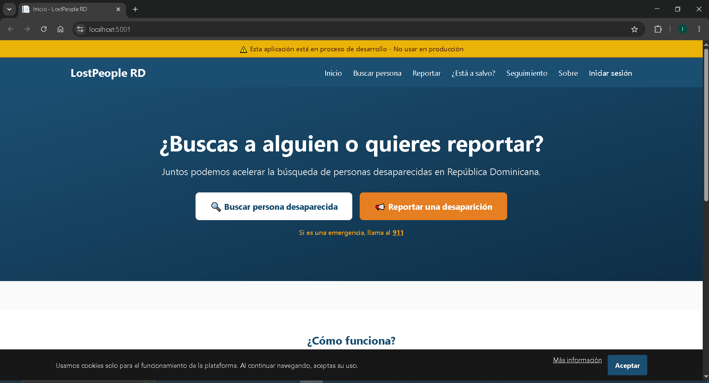

# LostPeople RD — Plataforma de Personas Desaparecidas



**Idea original por: Nicole Morel Checo**

> Una plataforma digital complementaria para la búsqueda, reporte y localización de personas desaparecidas en República Dominicana. No sustituye a la Policía Nacional ni al 911.

---

## Tabla de Contenidos

1. [Problema](#problema)
2. [Actores del Sistema](#actores-del-sistema)
3. [Arquitectura](#arquitectura)
4. [Stack Tecnológico](#stack-tecnológico)
5. [Modelo de Datos](#modelo-de-datos)
6. [Pantallas](#pantallas)
7. [API REST](#api-rest)
8. [Motor de Matching](#motor-de-matching)
9. [Ingesta de Datos](#ingesta-de-datos)
10. [Trabajos Programados](#trabajos-programados)
11. [Seguridad](#seguridad)
12. [Roadmap](#roadmap)
13. [Inicio Rápido](#inicio-rápido)
14. [Estructura del Proyecto](#estructura-del-proyecto)
15. [Legal](#legal)

---

## Problema

En República Dominicana, la información sobre una persona desaparecida vive fragmentada entre la Policía Nacional, hospitales públicos, la Procuraduría, medios de comunicación, redes sociales y la memoria de los familiares. No existe un punto único, accesible al ciudadano y actualizado en tiempo casi real, donde cualquier persona pueda:

- **(a) Reportar** una desaparición
- **(b) Verificar** si alguien ha sido localizado
- **(c) Cruzar datos** — voluntaria y colaborativamente — para acelerar la resolución de casos

LostPeople RD resuelve esto proporcionando una plataforma centralizada, de acceso público y gratuito, con herramientas de scraping automático de fuentes oficiales, un motor de coincidencias difusas (fuzzy matching) y un flujo de verificación humana para garantizar la calidad de los datos.

---

## Actores del Sistema

| # | Actor | ¿Requiere registro? | Rol en el sistema |
|---|---|---|---|
| A01 | **Ciudadano reportante** | Mínimo: correo/teléfono | Reporta una desaparición, recibe código de seguimiento |
| A02 | **Familiar / Tutor legal directo** | Sí (verificación) | Accede al panel de seguimiento, recibe notificaciones |
| A03 | **Voluntario verificador** | Sí + capacitación | Revisa y confirma coincidencias entre reportes y registros |
| A04 | **Agente policial verificador** | Sí + credencial oficial | Actualiza estados de caso, cierra casos resueltos |
| A05 | **Personal de salud / hospitalario** | Sí + credencial institucional | Reporta pacientes NN (no identificados) |
| A06 | **Administrador de plataforma** | Sí (rol admin) | Gestiona fuentes, usuarios, configuración del sistema |
| A07 | **Superadmin gubernamental** | Sí (designado) | Auditoría, configuración global, supervisión |
| A08 | **Visitante anónimo** | No | Busca personas, ve estadísticas, sin registro |

---

## Arquitectura

Clean Architecture en 4 capas con ASP.NET Core MVC 8:

```
┌─────────────────────────────────────────────┐
│           Presentation Layer (Web)           │
│     Razor Views + Tailwind CSS + Controllers │
├─────────────────────────────────────────────┤
│         Application Layer (Application)      │
│     DTOs, Validators, Interfaces de Servicio │
├─────────────────────────────────────────────┤
│      Infrastructure Layer (Infrastructure)   │
│  EF Core + SQL Server, Scraping, Matching,   │
│  Background Jobs (Quartz.NET), Notificaciones │
├─────────────────────────────────────────────┤
│            Domain Layer (Domain)             │
│      Entidades, Enums, Interfaces Base       │
└─────────────────────────────────────────────┘
```

**Flujo de datos principal:**

1. Ciudadano reporta una desaparición → `ReportarController`
2. El sistema genera un código único de seguimiento (`LP-XXXXX`)
3. Motores de scraping consultan fuentes externas automáticamente
4. El motor de matching (Jaro-Winkler) compara reportes vs registros ingeridos
5. Coincidencias encontradas → pasan a cola de verificación humana
6. Verificador confirma o rechaza la coincidencia
7. Notificaciones enviadas a las partes involucradas
8. Caso se marca como localizado o cerrado

---

## Stack Tecnológico

| Componente | Tecnología |
|---|---|
| **Lenguaje** | C# 12 (.NET 8 LTS) |
| **Framework** | ASP.NET Core MVC 8 |
| **ORM** | Entity Framework Core 8 |
| **Base de datos** | SQL Server 2022+ |
| **Frontend** | Razor Pages + Tailwind CSS 3 (CDN) |
| **Matching** | Jaro-Winkler (implementación propia) |
| **Scraping** | AngleSharp + HttpClient + Polly (retry) |
| **Background Jobs** | Quartz.NET 3 |
| **Logging** | Serilog (archivo + consola) |
| **Validación** | FluentValidation, DataAnnotations |
| **Testing** | xUnit + Moq |
| **Cache** | IMemoryCache (in-memory) |

---

## Modelo de Datos

15 entidades principales con relaciones completas, FK, índices únicos y filtrados:

### Entidades Core

| Entidad | Descripción | Relaciones clave |
|---|---|---|
| **PersonaReportada** | Persona desaparecida o no identificada | 1:N Reportes, 1:N Coincidencias, N:1 EstadoCaso, N:1 ZonaGeografica |
| **Reporte** | Reporte individual de desaparición | N:1 PersonaReportada, N:1 Usuario, N:1 EstadoCaso, 1:N Archivos |
| **EstadoCaso** | Catálogo de estados (7 flujos) | 1:N PersonasReportadas, 1:N Reportes |
| **ZonaGeografica** | Catálogo geográfico jerárquico (provincias, municipios) | Self-referencing (ZonaPadre), N:1 PersonasReportadas |
| **Usuario** | Usuarios del sistema | N:1 Rol, 1:N Reportes, 1:N SesionesUsuario, 1:N Verificaciones |
| **Rol** | Roles y permisos (Ciudadano a SuperAdmin) | 1:N Usuarios |

### Entidades de Operación

| Entidad | Descripción |
|---|---|
| **FuenteDatos** | Configuración de fuentes externas (URL, método, intervalo, riesgo legal) |
| **RegistroIngerido** | Datos obtenidos de fuentes externas vía scraping |
| **Coincidencia** | Resultado del matching entre PersonaReportada y RegistroIngerido |
| **Notificacion** | Notificaciones enviadas (SMS, email, in-app) |
| **Auditoria** | Trazabilidad completa de cambios en el sistema |
| **Archivo** | Fotos y documentos adjuntos a reportes |
| **CentroSalud** | Catálogo de centros de salud del país |
| **Verificacion** | Registro de acciones de verificación por verificadores |
| **SesionUsuario** | Control de sesiones activas |

Volumen estimado MVP: 500-1,000 personas reportadas, 2-3 fuentes, 10K registros ingeridos, 5K coincidencias.

---

## Pantallas

### Mapa de navegación completo

```
Landing (pública)
├── /                          → Hero, alertas activas, estadísticas, cómo funciona
├── /buscar                    → Búsqueda con 8 filtros + resultados paginados
├── /buscar/detalle/{id}       → Detalle de persona: foto, datos, línea de tiempo
├── /reportar                  → Formulario paso a paso (6 pasos)
├── /reportar/exito            → Confirmación + código de seguimiento LP-XXXXX
├── /reportar/localizada       → Reportar que una persona fue localizada
├── /reportar/seguimiento      → Buscar estado de un caso por código
├── /reportar/estado           → Estado detallado del caso con línea de tiempo
├── /home/sobre                → Información del proyecto y marco legal
├── /home/contacto             → Contacto de autoridades oficiales
├── /home/privacy              → Política de protección de datos (Ley 172-13)
└── (rutas futuras)
    ├── /mapa                  → Mapa de casos activos
    ├── /auth/login            → Inicio de sesión
    ├── /auth/register         → Registro de usuario
    ├── /panel/                → Dashboard de seguimiento
    │   ├── /familiar          → Panel del familiar
    │   ├── /verificador       → Cola de verificación
    │   ├── /verificador/match → Comparación lado a lado
    │   ├── /admin             → Dashboard admin
    │   ├── /admin/fuentes     → Gestión de fuentes
    │   ├── /superadmin/config → Configuración global
    │   └── /superadmin/audit  → Auditoría
```

### Sistema de diseño

| Elemento | Especificación |
|---|---|
| **Paleta primaria** | Azul profundo (#1B4F72), Naranja (#E67E22), Verde (#27AE60), Rojo (#C0392B) |
| **Alertas** | Amber (#FFBF00), Silver (#C0C0C0), Azul (#3498DB), Rosa (#E91E63) |
| **Tipografía** | Inter (sans-serif), base 16px, escala 12-48px |
| **Botones** | 48px altura, border-radius 8px |
| **Tarjetas** | Border 1px, border-radius 12px |
| **Inputs** | 48px altura, border-radius 8px |
| **Responsive** | Móvil <640px (1 col), Tablet 640-1024px (2 cols), Desktop >1024px (3 cols) |
| **Accesibilidad** | WCAG AA, skip-to-main, aria-label, keyboard nav, 44px touch targets |

---

## API REST

### Endpoints públicos (sin autenticación)

| Método | Ruta | Descripción |
|---|---|---|
| GET | `/api/v1/public/stats` | Estadísticas generales del sistema |
| GET | `/api/v1/public/persons` | Listado público de personas (con filtros) |
| GET | `/api/v1/public/persons/{id}` | Detalle de una persona |
| POST | `/api/v1/public/reports` | Crear un reporte de desaparición |
| POST | `/api/v1/public/reports/verify-contact` | Verificar contacto del reportante |
| GET | `/api/v1/public/reports/{code}/status` | Estado actual de un caso por código |

### Endpoints autenticados

| Método | Ruta | Descripción |
|---|---|---|
| PUT | `/api/v1/reports/{id}/close` | Cerrar un caso como localizado |
| POST | `/api/v1/persons/{id}/photos` | Subir fotos de una persona |
| GET | `/api/v1/matches/pending` | Coincidencias pendientes de revisión |
| PUT | `/api/v1/matches/{id}/review` | Revisar y resolver una coincidencia |
| POST | `/api/v1/health/patients` | Registrar paciente no identificado |
| GET | `/api/v1/notifications` | Notificaciones del usuario |
| PUT | `/api/v1/notifications/{id}/read` | Marcar notificación como leída |

### Endpoints admin/superadmin

| Método | Ruta | Descripción |
|---|---|---|
| GET | `/api/v1/admin/dashboard` | Dashboard administrativo |
| GET | `/api/v1/admin/sources` | Listado de fuentes de datos |
| POST | `/api/v1/admin/sources/{id}/trigger` | Forzar scraping de una fuente |
| PUT | `/api/v1/admin/sources/{id}/toggle` | Activar/desactivar fuente |
| GET | `/api/v1/admin/users` | Gestión de usuarios |
| PUT | `/api/v1/admin/users/{id}/verify` | Verificar/desverificar usuario |
| GET | `/api/v1/admin/audit` | Log de auditoría |
| PUT | `/api/v1/admin/config/matching` | Configurar umbrales de matching |
| GET | `/api/v1/admin/exports/report` | Exportar reporte consolidado |

---

## Motor de Matching

El motor de coincidencias utiliza el algoritmo **Jaro-Winkler** con ponderación por campos:

### Pesos por campo

| Campo | Peso | Descripción |
|---|---|---|
| Nombre completo | 0.35 | Jaro-Winkler sobre nombre + apellidos |
| Edad | 0.15 | Diferencia absoluta en años |
| Sexo | 0.05 | Coincidencia exacta |
| Ubicación | 0.20 | Coincidencia de provincia o municipio |
| Descripción física | 0.25 | Jaro-Winkler sobre señas particulares |

### Flujo de decisión

```
Registro ingerido → preprocesamiento (limpieza, normalización)
         ↓
Comparación contra cada PersonaReportada activa
         ↓
Cálculo de score ponderado (0.0 - 1.0)
         ↓
Si score >= 0.7 → crear Coincidencia con estado "Pendiente"
         ↓
Verificador humano revisa y confirma/rechaza
         ↓
Si confirmada → notificación a familiar + actualización de estado
```

---

## Ingesta de Datos

El sistema puede conectarse a múltiples fuentes externas mediante un diseño extensible basado en `IDataSourceConnector`:

### Fuentes implementadas

| Conector | Tipo | Método | Estado |
|---|---|---|---|
| **PoliciaNacionalConnector** | API REST | HTTP con Polly retry | Esqueleto (requiere endpoint real) |
| **DatosGobDoConnector** | HTML Scraping | AngleSharp | Esqueleto (URL placeholder) |
| **HospitalSimuladoConnector** | Simulado | Datos sintéticos | Demostración funcional |

### Pipeline de ingesta

```
FuenteDatos (configuración)
    ↓
IDataSourceConnector.FetchAsync()
    ↓
Transformación a RegistroIngerido
    ↓
Deduplicación por hash SHA256
    ↓
Almacenamiento en DB
    ↓
Disparar MatchingSchedulerJob
```

Cada fuente tiene metadatos de riesgo legal asociados para cumplir con la normativa de protección de datos al scraping.

---

## Trabajos Programados

El sistema utiliza **Quartz.NET** con 3 trabajos en segundo plano:

| Job | Intervalo | Descripción |
|---|---|---|
| **ScrapingSchedulerJob** | Cada 30 minutos | Itera fuentes activas, ejecuta scraping |
| **MatchingSchedulerJob** | Cada 15 minutos | Procesa nuevos registros contra reportes activos |
| **SourceHealthCheckJob** | Cada 6 horas | Monitorea estado de salud de las fuentes |

Los trabajos están configurados con `[DisallowConcurrentExecution]` para evitar ejecuciones superpuestas.

---

## Seguridad

### Implementado actualmente

- CSRF: `[ValidateAntiForgeryToken]` en todos los POST
- Validación servidor: `ModelState.IsValid` en todos los handlers
- Validación cliente: FluentValidation + jQuery unobtrusive
- HTTPS: `UseHttpsRedirection()` y `UseHsts()` (producción)
- Auditoría: `Auditorias` con IP, UserAgent, valores anteriores/nuevos
- Contraseñas: columna `PasswordHash` con capacidad para bcrypt/argon2

### Diseñado para implementación futura

- Autenticación JWT o cookie-based
- RBAC completo con matriz 8 roles × 15 permisos
- Rate limiting por IP (3 reportes/hora, 1 verificación/hora)
- Cifrado AES-256 en reposo para datos sensibles
- ReCAPTCHA v3 en formularios públicos
- Bloqueo por intentos fallidos (5 → 30 min)
- 2FA opcional
- Watermark en fotos
- CSP, X-Frame-Options, X-Content-Type-Options

---

## Roadmap

| Fase | Timeline | Entregables clave |
|---|---|---|
| **MVP** (actual) | 0-3 meses | Reportar, buscar, verificar, cerrar. Scraping 2-3 fuentes. Matching difuso. Panel verificación. Dashboard. Notificaciones SMS/email. |
| **Fase 2 — Integración institucional** | 3-6 meses post-MVP | Convenio Policía Nacional (API Registro Nacional), SNS (feed hospitalario), 9-1-1, Procuraduría/INACIF. 2FA. Mapa Leaflet. API pública. |
| **Fase 3 — Mobile** | 6-12 meses post-MVP | App nativa (Flutter/MAUI), push notifications, geocercas, reporte por voz, RRSS, portal transparencia. |
| **Fase 4 — IA y Analítica** | 12-18 meses | IA priorización, reconocimiento facial (con marco legal), patrones desaparición, chatbot, dashboard Consejo Alertas RD. |
| **Fase 5 — Sostenibilidad y Escala** | 18-24 meses | INTERPOL, aeropuertos/fronteras, replicabilidad regional, ISO 27001, transferencia tecnológica al Estado (OGTIC/DIGEIG). |

---

## Inicio Rápido

### Requisitos

- .NET SDK 8.0+
- SQL Server 2022+ (local o remoto)

### 1. Clonar y restaurar

```bash
git clone <repo-url>
cd LostPeople
dotnet restore
```

### 2. Configurar base de datos

Editar `src/Web/appsettings.json` con tu connection string:

```json
"ConnectionStrings": {
  "DefaultConnection": "Server=localhost;Database=LostPeople;User Id=sa;Password=tu_password;TrustServerCertificate=True;Connection Timeout=30;"
}
```

### 3. Aplicar migraciones

```bash
dotnet ef database update --project src/Infrastructure --startup-project src/Web
```

### 4. Ejecutar

```bash
dotnet run --project src/Web --urls http://localhost:5000
```

### 5. Abrir en navegador

Visitar `http://localhost:5000`

---

## Estructura del Proyecto

```
LostPeople/
├── FASE-00-SKILLS-MAP.md       → Habilidades y competencias requeridas
├── FASE-01-REQUIREMENTS.md     → Requisitos, user stories, casos de uso
├── FASE-02-DESIGN.md           → Diseño arquitectónico, ER, API, seguridad
├── FASE-03-UX-SPEC.md          → Especificación de UX, wireframes, diseño
├── FASE-04-TASKS.md            → Plan de tareas, estimaciones, roadmap
├── database-schema.sql         → Script SQL completo de la base de datos
├── LostPeople.sln              → Solución de Visual Studio
├── src/
│   ├── Domain/                 → Capa de dominio
│   │   ├── Entities/           → 15 entidades del modelo de datos
│   │   ├── Enums/              → AlertType, CaseStatus, DataSourceType, etc.
│   │   └── Interfaces/         → IAggregateRoot, IEntity, IRepository, etc.
│   ├── Application/            → Capa de aplicación
│   │   ├── Common/
│   │   │   ├── DTOs/           → ReporteDto, DashboardDto, MatchDto
│   │   │   └── Interfaces/     → IAuditService, IMatchingService, etc.
│   │   └── DependencyInjection.cs
│   ├── Infrastructure/         → Capa de infraestructura
│   │   ├── BackgroundJobs/     → ScrapingSchedulerJob, MatchingSchedulerJob, HealthCheckJob
│   │   ├── Matching/           → FuzzyMatchingService (Jaro-Winkler)
│   │   ├── Persistence/        → DbContext, Repository, UnitOfWork, Migrations
│   │   ├── Scraping/           → PoliciaNacionalConnector, DatosGobDoConnector, etc.
│   │   ├── Services/           → AuditService, CodigoGenerator, NotificationService
│   │   └── DependencyInjection.cs
│   └── Web/                    → Capa de presentación
│       ├── Controllers/        → HomeController, BuscarController, ReportarController
│       ├── ViewModels/         → ReportarViewModel, LocalizadaViewModel
│       ├── Views/              → 10 vistas Razor + 3 parciales
│       ├── wwwroot/            → CSS, JS, librerías CDN offline
│       ├── Program.cs          → Punto de entrada
│       └── appsettings.json    → Configuración
```

---

## Legal

- **Protegido por Ley 172-13** de Protección de Datos Personales de República Dominicana
- **Cumplimiento con Ley 136-03** (Código para la Protección de Niños, Niñas y Adolescentes)
- **Alineado con Ley 25-26** "Alertas RD" (promulgada junio 2026)
- Plataforma **complementaria** — no sustituye a la Policía Nacional (911) ni a los servicios de emergencia
- Datos de fuentes externas marcados como **"pendiente de verificación"**
- **Tolerancia cero** a la exposición de datos de menores de edad
- Datos demo sintéticos explícitamente identificados

---

*Construido con Clean Architecture, .NET 8, y el compromiso de ayudar a que más personas regresen a casa.*
